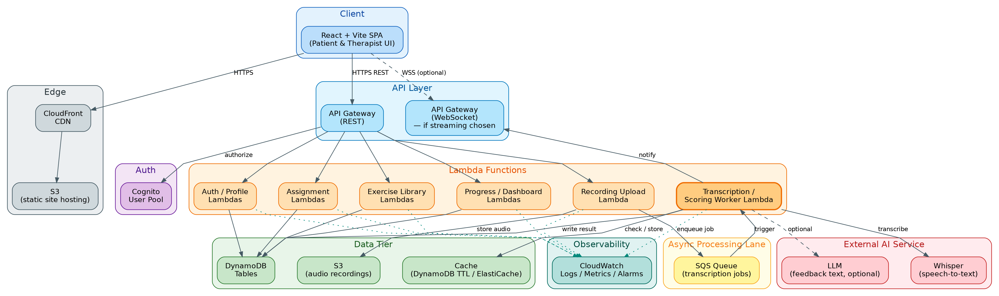

# 🎙️ AI-Powered Speech Therapy Companion

[-blue.svg)](#)
[](#)
[](#)
[-FF9900.svg)](#)
[](#)

An intelligent, cloud-native web application designed to bridge the gap between clinical speech therapy sessions and patient home practice. The platform enables Speech-Language Pathologists (SLPs) to assign tailored articulation exercises while providing patients with real-time audio recording, asynchronous AI transcription via **OpenAI Whisper**, and automated articulation scoring.

---

## 📑 Table of Contents
- [Problem & Mission](#-problem--mission)
- [Key Features](#-key-features)
- [System Architecture](#-system-architecture)
- [Tech Stack](#-tech-stack)
- [Repository Structure](#-repository-structure)
- [Detailed Documentation](#-detailed-documentation)
- [Getting Started](#-getting-started)
- [Security & Data Privacy](#-security--data-privacy)

---

## 🎯 Problem & Mission

Traditional speech therapy relies heavily on periodic in-clinic visits supplemented by unsupervised home practice. Patients frequently struggle without immediate feedback on pronunciation accuracy, while therapists lack objective data on adherence and progress between visits.

The **AI-Powered Speech Therapy Companion** solves this with:
1. **Asynchronous Home Practice**: Patients record guided exercises with immediate feedback.
2. **Objective Articulation Scoring**: Speech recognition powered by Whisper evaluates phoneme-level and word-level accuracy.
3. **Caseload Analytics for Therapists**: Clinicians track longitudinal progress, identify regression, and tailor future assignments.

---

## ✨ Key Features

### For Patients
* **Low-Friction Recording**: Browser-native microphone recording with waveform visualizer and immediate playback.
* **Instant & Asynchronous Feedback**: Non-blocking evaluation showing pronunciation accuracy, target comparisons, and motivational feedback.
* **Progress Tracking**: Personal milestone badges and historical score trends across sessions.

### For Speech Therapists
* **Curated Exercise Library**: Create, categorize, and manage exercises targeting specific phonemes, words, or full phrases.
* **Caseload Management & Assignments**: Assign customized practice plans to specific patients with target completion dates.
* **Clinical Dashboards**: Longitudinal visual trends, attempt histories, and audio playback of submitted patient exercises.

---

## 🏗️ System Architecture

The application adopts a **serverless, event-driven, three-tier cloud architecture** designed for high scalability, sub-second API responsiveness, and strict cost controls:



### Architectural Highlights
* **Non-Blocking AI Pipeline**: Audio uploads are decoupled from speech processing. The client requests a presigned S3 URL, uploads audio directly, and an **Amazon SQS** queue dispatches worker Lambdas for Whisper transcription without keeping HTTP connections open.
* **Serverless-First Compute**: Powered entirely by AWS Lambda and Amazon DynamoDB, scaling to zero when idle to minimize operational overhead.
* **Least-Privilege Security**: Direct-to-S3 uploads via scoped presigned URLs; role-based access control (RBAC) enforced via Amazon Cognito.

---

## 💻 Tech Stack

| Layer | Technologies |
|---|---|
| **Frontend / Presentation** | React (SPA), Vite, Modern Vanilla CSS, Web Audio API |
| **Hosting & Edge** | AWS S3 (Static Hosting), AWS CloudFront (CDN) |
| **Authentication & AuthZ** | AWS Cognito (User Pools with Patient & Therapist Groups) |
| **API & Routing** | Amazon API Gateway (REST APIs) |
| **Compute & Backend** | AWS Lambda (Python / TypeScript runtime) |
| **Async Processing & Queues**| Amazon SQS (Dead Letter Queue + Retry Policies) |
| **Data & Storage** | Amazon DynamoDB (Single-table design), Amazon S3 (Audio recordings) |
| **Speech-to-Text & AI** | OpenAI Whisper API, Custom Phoneme/Pronunciation Scoring Engine |
| **Observability & Logging** | AWS CloudWatch (Metrics, Alarms, Structured Logs) |

---

## 📂 Repository Structure

```text
AI_Project/
├── docs/                                  # Engineering & Architectural Specifications
│   ├── assets/                            # Architecture diagrams, mockups, and assets
│   │   └── architecture-diagram_v1.png
│   ├── SDS-speech-therapy-companion_v1.md # System Design Specification
│   └── SRS-speech-therapy-companion_v1.md # Software Requirements Specification
├── frontend/                              # React + Vite client application (Phase 2 build)
├── backend/                               # AWS Lambda microservices & shared utilities
│   ├── handlers/                          # API Gateway Lambda handlers (Auth, Exercises, etc.)
│   └── workers/                           # SQS AI transcription & scoring consumer
├── infrastructure/                        # Infrastructure as Code (AWS SAM / CDK / Terraform)
├── .gitignore                             # Comprehensive Git ignore rules
└── README.md                              # Project overview and developer guide
```

---

## 📖 Detailed Documentation

Comprehensive engineering documents are available in the [`docs/`](docs/) directory:
* 📄 [**Software Requirements Specification (SRS)**](docs/SRS-speech-therapy-companion_v1.md) — Functional requirements, user stories, non-functional latency/throughput constraints, and business rules.
* 📐 [**Software Design Specification (SDS)**](docs/SDS-speech-therapy-companion_v1.md) — DynamoDB schema design, API contracts, sequence diagrams, failure recovery, and cost estimation models.
* 🖼️ [**Architecture Diagram**](docs/assets/architecture-diagram_v1.png) — High-level cloud component topology.

---

## 🚀 Getting Started

*(Local development environment setup will be detailed as Phase 2 code is initialized).*

### Prerequisites
* **Node.js** (v20+ LTS recommended)
* **Python** (v3.11+)
* **AWS CLI** configured with appropriate development profile
* **Git**

### Clone and Branching Workflow
```bash
git clone https://github.com/danindu2024/AI-Speech-Therapy-Companion.git
cd AI-Speech-Therapy-Companion

# Always branch off main following conventional naming
git checkout -b feature/<feature-name>
```

---

## 🔒 Security & Data Privacy

Because voice recordings represent sensitive personal and health-adjacent data:
* **Audio Access**: All audio files stored in S3 are encrypted at rest with AWS KMS and accessible only via short-lived, authenticated presigned URLs.
* **No Public Buckets**: S3 buckets block all public access by default.
* **Separation of Concerns**: Patient identifying data and speech recording metadata are strictly segregated with fine-grained DynamoDB access policies.