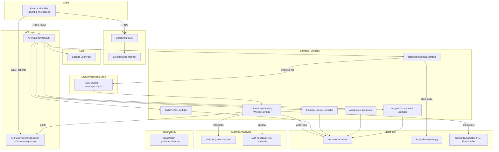
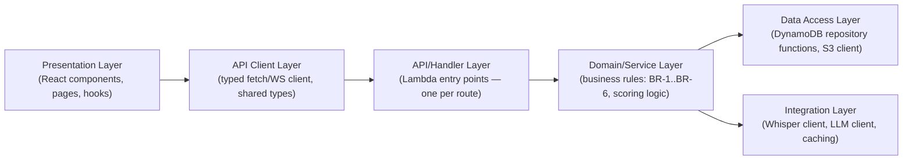
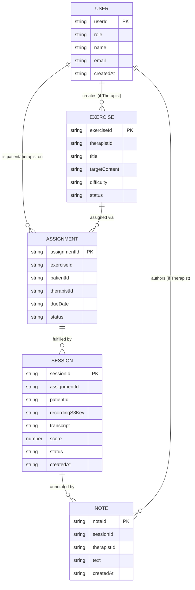
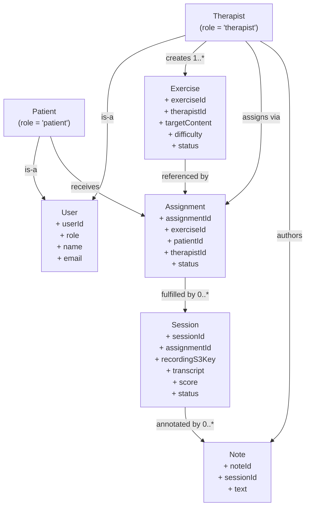
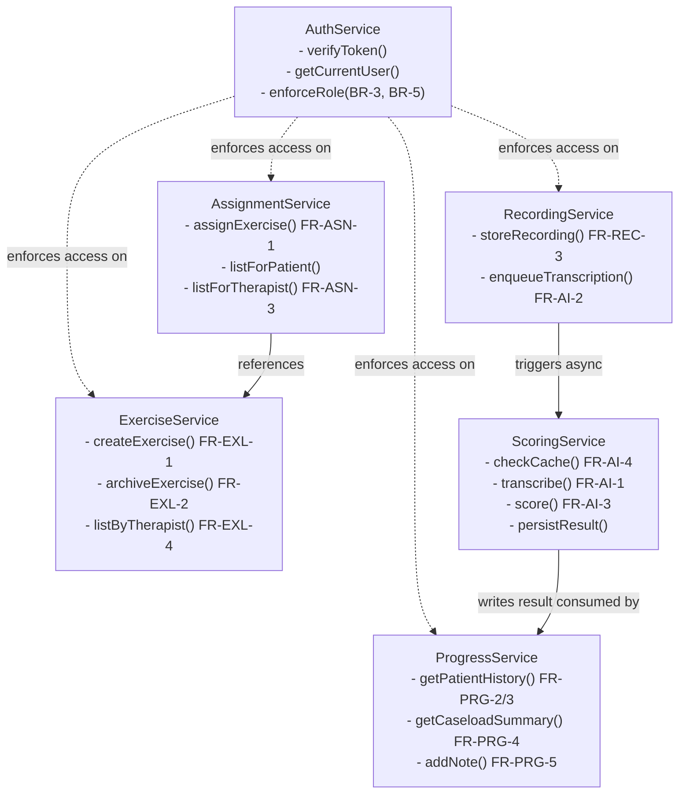
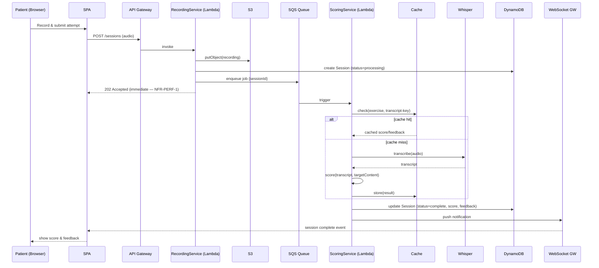
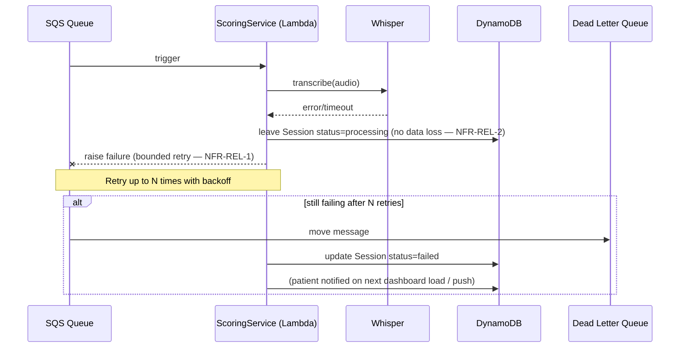
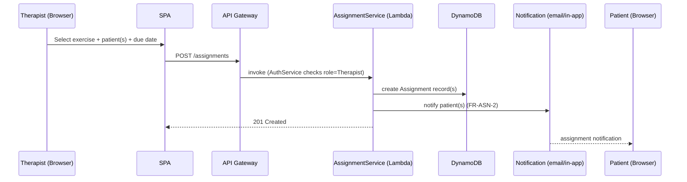
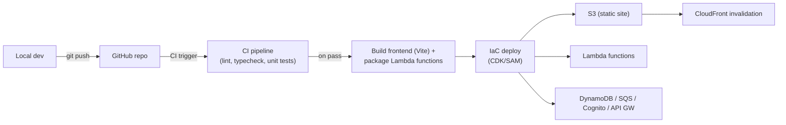

# Software Design Specification (SDS)
## AI-Powered Speech Therapy Companion

**Document version:** 1.0
**Date:** 2026-09-21
**Project reference:** Flagship project, Phase 2 — derives directly from `SRS-speech-therapy-companion_v1.md`, `career-mentoring-guide_v2.md` (Section 6 & 8), and `flagship-project-tracker_v1.md`.
**Prepared by:** [Your name]

> **Note on this draft:** This SDS translates the SRS's functional/non-functional requirements into a concrete design. Where the SRS left a decision as `[TBD — confirm]`, this document either proposes a default (flagged `[Design assumption]`) or carries the same open flag forward — it does not silently resolve things the SRS left open.

---

## 1. Introduction

### 1.1 Purpose
This document describes **how** the AI-Powered Speech Therapy Companion is built, as the technical counterpart to the SRS's **what**. It covers the system's architecture, data design, module/interaction structure, security design, and deployment design, so implementation (Phase 2 build, tracked in `flagship-project-tracker_v1.md`) has a concrete blueprint to follow rather than being designed ad hoc feature-by-feature.

### 1.2 Scope
This SDS covers the design of every functional area defined in the SRS (Section 4): account management, exercise library, assignment, recording/submission, AI transcription & scoring, and progress tracking — plus the cross-cutting concerns the SRS's non-functional requirements demand (async processing, cost control, security, observability).

It does not re-derive requirements already stated in the SRS; each design decision below references the SRS requirement ID it satisfies (`FR-*`, `NFR-*`, `BR-*`) so the two documents stay traceable to each other.

### 1.3 Design Goals (derived from SRS constraints & NFRs)
1. **Non-blocking AI pipeline** — no HTTP request waits on Whisper (NFR-PERF-1, FR-AI-2).
2. **Serverless-first** — minimize operational burden for a solo developer (C-2, NFR-SCAL-1).
3. **Least-privilege security by default**, not retrofitted (NFR-SEC-1–4, BR-3/5).
4. **Cost-aware AI usage** — caching/optimization designed in from the start (NFR-COST-1, FR-AI-4).
5. **Demo-and-interview-ready** — the design should be explainable in an interview as a deliberate set of trade-offs, not just "it works" (ties to Section 5.2/5.3 of the master career guide).

---

## 2. Architectural Design

### 2.1 Architectural Style
A **serverless, event-driven, three-tier architecture** on AWS:
- **Presentation tier:** React + Vite single-page app, statically hosted.
- **Application tier:** AWS Lambda functions behind API Gateway (REST + WebSocket), stateless.
- **Data tier:** DynamoDB (primary store) + S3 (audio/binary assets).

An **asynchronous processing lane** sits alongside the synchronous request/response path specifically to satisfy FR-AI-2 / NFR-PERF-1: the AI pipeline is decoupled from the user-facing request cycle.

### 2.2 High-Level Component Diagram

**Design rationale:**
- The **Recording Upload Lambda** (`L_REC`) only stores the audio and enqueues a job — it returns immediately, satisfying NFR-PERF-1.
- The **Transcription/Scoring Worker Lambda** (`L_PROC`) is the only component that talks to Whisper/LLM, isolating the AI dependency and its cost/latency profile from the rest of the system — this is also where FR-AI-4 (caching/prompt optimization) lives.
- Whether `L_PROC` notifies the client via the **WebSocket** gateway (streaming/push) or the client **polls** a REST endpoint depends on the Week 6 decision in `flagship-project-tracker_v1.md`; this diagram shows the WebSocket path as the primary option, with polling as the fallback if WebSocket infrastructure proves too heavy for the timeline (C-1).

### 2.3 Layered View (logical, not physical)

This separation (handler → domain/service → data access) is what NFR-MAINT-1 refers to as "shared utility/auth layers rather than duplicated logic per function" — the domain layer holds business rules once, and multiple Lambda handlers call into it rather than re-implementing rules like BR-3 ("patient can only access their own data") in each handler independently.

---

## 3. Database Design

### 3.1 Technology Choice
**DynamoDB** (per SRS Section 13, "Alternative Solutions Considered" — chosen deliberately over the already-known MySQL to build a genuine NoSQL competency and to practice access-pattern-driven schema design).

### 3.2 Design Approach
A **multi-table design** is used for MVP clarity and faster iteration, rather than a fully denormalized single-table design. `[Design assumption]` — single-table design is a well-known DynamoDB best practice and a legitimate future refactor (worth mentioning explicitly in interviews as "I chose multi-table for velocity at this scale, and can explain the single-table trade-off"), but is not required to satisfy any SRS requirement at MVP data volumes (SRS 12.3).

### 3.3 Entity-Relationship Overview

### 3.4 Table Definitions & Access Patterns

| Table | Partition Key | Sort Key | GSI(s) | Access Patterns Served |
|---|---|---|---|---|
| `Users` | `userId` | — | `GSI-Role` (role) | Get user by ID (FR-AUTH-3); list users by role (admin/reporting use). |
| `Exercises` | `exerciseId` | — | `GSI-Therapist` (therapistId, status) | Get exercise by ID; list a therapist's exercise library filtered by status/tag (FR-EXL-4). |
| `Assignments` | `patientId` | `assignmentId` | `GSI-Therapist` (therapistId, status) | List a patient's assigned exercises (FR-ASN-1, UC-1 step 1); list a therapist's outstanding assignments across their caseload (FR-ASN-3). |
| `Sessions` | `patientId` | `createdAt#sessionId` | `GSI-Assignment` (assignmentId) | Patient's session history sorted by time (FR-PRG-2/3); look up sessions for a given assignment (progress-per-exercise). |
| `Notes` | `sessionId` | `noteId` | — | Fetch notes for a session (FR-PRG-5). |

**Why this key design:** Patient-scoped queries (their own assignments, their own session history) are the hottest read path (every UC-1 execution) and are satisfied by a single partition-key query with no scan — directly supporting NFR-PERF-2 and NFR-SCAL-1.

### 3.5 Caching (FR-AI-4 / NFR-COST-1)
A cache-check step precedes any Whisper/LLM call in `L_PROC`: the scoring engine normalizes the exercise+transcript pair into a cache key; a hit skips the external AI call entirely. `[Design assumption]`: DynamoDB with a TTL attribute is used for this cache rather than provisioning a separate ElastiCache cluster, since it avoids a second data store and its own ongoing cost/operational overhead — ElastiCache remains the documented alternative if cache read volume later justifies it (this trade-off itself is useful interview material per SRS Section 5.2).

---

## 4. Class Diagram (as Flow Diagrams)

Presented as flowcharts (per request) rather than UML class notation, showing the core domain types and their relationships/dependencies.

### 4.1 Domain Entity Relationships

### 4.2 Service/Module Responsibilities

`AuthService` is drawn as cross-cutting (dotted lines) rather than a peer service, since every other service depends on it for role enforcement — this is the concrete implementation of BR-3/BR-5 and NFR-SEC-3.

---

## 5. Sequence Diagrams (Flow)

### 5.1 UC-1 — Patient Completes an Assigned Exercise (happy path)

### 5.2 UC-1 — Failure & Retry Sub-flow

### 5.3 UC-2 — Therapist Assigns an Exercise

---

## 6. Security Design

### 6.1 Authentication & Session Management
- AWS Cognito issues JWTs on login (FR-AUTH-2); API Gateway validates the JWT via a Cognito authorizer before any Lambda handler executes — invalid/expired tokens never reach application code.
- Password reset (FR-AUTH-4) uses Cognito's built-in flow rather than a custom implementation, avoiding a common source of auth vulnerabilities.

### 6.2 Authorization (BR-3, BR-5, NFR-SEC-3)
- **Defense in depth, not UI-only gating:** every Lambda handler re-derives the caller's identity/role from the verified JWT claims (never trusts a client-supplied `userId`), and the domain/service layer (Section 2.3) enforces "a patient can only touch their own records" and "a therapist can only touch their own caseload" on every read/write — not just on the routes that look sensitive.
- Cross-role checks are centralized in `AuthService.enforceRole()` (Section 4.2) rather than duplicated per handler, so an authorization bug fixed once is fixed everywhere (also serves NFR-MAINT-1).

### 6.3 Data Protection (NFR-SEC-2, NFR-SEC-4)
- **In transit:** HTTPS enforced on API Gateway and CloudFront; WSS for the WebSocket path.
- **At rest:** DynamoDB encryption-at-rest enabled (AWS-managed keys, minimum); S3 bucket for recordings has default encryption enabled and is **not public** — the SPA never gets a direct public S3 URL for a recording. Instead, the recording-upload and recording-playback flows use **short-lived pre-signed URLs**, generated per-request after the authorization check in 6.2 passes.
- Recordings/transcripts are treated as PHI-adjacent (SRS NFR-SEC-4) — no analytics/logging pipeline should log raw transcript content; CloudWatch logs (Section 7) log metadata (session ID, status, timing) rather than content.

### 6.4 Secrets Management
- Whisper/LLM API keys are stored in **AWS Secrets Manager** (or SSM Parameter Store for a lower-cost MVP option — `[Design assumption]`, revisit if secret rotation becomes a requirement), never in code, environment files committed to source control, or client-side bundles.

### 6.5 IAM (least privilege)
- Each Lambda function has its own IAM execution role scoped to only the resources it needs (e.g., `L_REC` can `PutObject` to the recordings bucket and write to its own DynamoDB table, but has no access to, say, the Users table) — this is deliberately granular rather than one shared "backend role," both for security and because it's directly relevant IAM practice for the AWS SAA exam (career guide Section 5.4).

### 6.6 Input Validation & Abuse Prevention
- All Lambda handlers validate request payloads (shape, size, allowed values) before touching the domain layer — rejects malformed input before it can reach DynamoDB or the Whisper API (also protects NFR-COST-1: malformed/spam requests shouldn't be able to trigger billable AI calls).
- API Gateway throttling/rate limits configured per-route as a baseline abuse guard `[Design assumption — default AWS throttling limits are acceptable for MVP scale, per SRS 12.3]`.

### 6.7 Audit Logging
- Access to session data (especially by a therapist viewing patient recordings/transcripts) is logged with actor, target patient, and timestamp — satisfies "access shall be logged" (SRS NFR-SEC-4) and gives a concrete artifact for the security-design conversation in interviews.

---

## 7. Deployment Design

### 7.1 Infrastructure as Code
The entire AWS stack (API Gateway, Lambda functions, DynamoDB tables, S3 buckets, Cognito pool, SQS queue, CloudFront distribution, IAM roles) is defined as code — `[Design assumption]`: **AWS SAM** or **AWS CDK (TypeScript)** is used rather than manual console setup, both for repeatability and because CDK-in-TypeScript keeps the whole stack in one language, consistent with the project's TypeScript-first stack decision (career guide Section 6). Either choice satisfies the requirement; CDK is slightly favored if the type-sharing between infra code and Lambda handler code is valued.

### 7.2 Environments
- **Dev/local:** Lambda functions testable locally (e.g., via SAM local or a lightweight local harness); DynamoDB Local optional for offline iteration.
- **Deployed (single environment for MVP):** `[Design assumption]` — given solo-developer scale (SRS C-2) and portfolio/demo purpose (A-7), a single deployed environment is used rather than separate dev/staging/prod AWS accounts. This is an explicit, defensible trade-off to name in interviews ("here's what I'd add for a real multi-environment SDLC") rather than an oversight.

### 7.3 Deployment Pipeline

- CI runs on every push (GitHub Actions is the natural default given the codebase is already on GitHub for the open-source/PR work in career guide Section 10).
- Deployment is a single `cdk deploy` (or `sam deploy`) step — deliberately simple given C-2 (solo developer, no dedicated DevOps role).

### 7.4 Monitoring & Alerting (NFR-OBS-1)
- CloudWatch Logs for every Lambda function; CloudWatch Metrics on: API error rate, Lambda duration/errors/throttles, SQS queue depth (a growing queue depth is the earliest signal that transcription is falling behind — directly useful for the latency-mitigation story in SRS Section 5.3/15 R-3).
- A small number of CloudWatch Alarms (`[Design assumption]`: e.g., SQS DLQ depth > 0, Lambda error rate > threshold) rather than a large dashboard — proportionate to portfolio/demo scale, not production-grade on-call tooling.

### 7.5 Rollback Strategy
- Since deployment is IaC-driven, rollback is `cdk deploy` (or `sam deploy`) of a previous git commit/tag rather than manual console changes — keeps the "what's actually deployed" always traceable to source control.

---

## 8. Traceability Summary

| SDS Section | Primary SRS Requirements Addressed |
|---|---|
| 2. Architectural Design | FR-AI-2, NFR-PERF-1, NFR-SCAL-1, NFR-MAINT-1 |
| 3. Database Design | Section 12 (Data Requirements), NFR-PERF-2, NFR-SCAL-1 |
| 4. Class/Module Design | NFR-MAINT-1, BR-2–BR-6 |
| 5. Sequence Diagrams | UC-1, UC-2, NFR-REL-1/2 |
| 6. Security Design | NFR-SEC-1–4, BR-3, BR-5 |
| 7. Deployment Design | C-2, NFR-SCAL-1, NFR-OBS-1 |

---

## Document Control

| Version | Date | Change |
|---|---|---|
| 1.0 | 2026-09-21 | Initial complete draft, derived from `SRS-speech-therapy-companion_v1.md` and the master career/build tracker documents. Diagrams rendered as Mermaid flowcharts/sequence diagrams per request. |

*Companion documents: `career-mentoring-guide_v2.md` (overall career plan), `DSA_v2.md` (Phase 1 execution), `flagship-project-tracker_v1.md` (Phase 2 execution), `SRS-speech-therapy-companion_v1.md` (requirements this design implements).*
